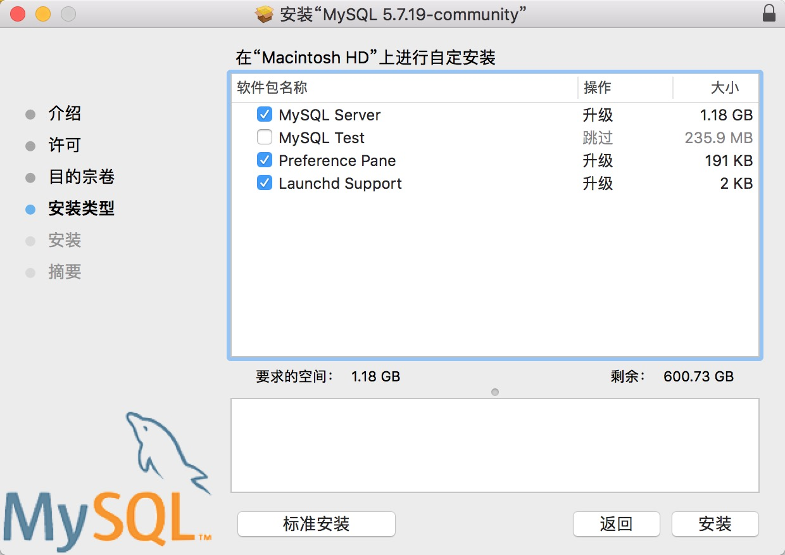
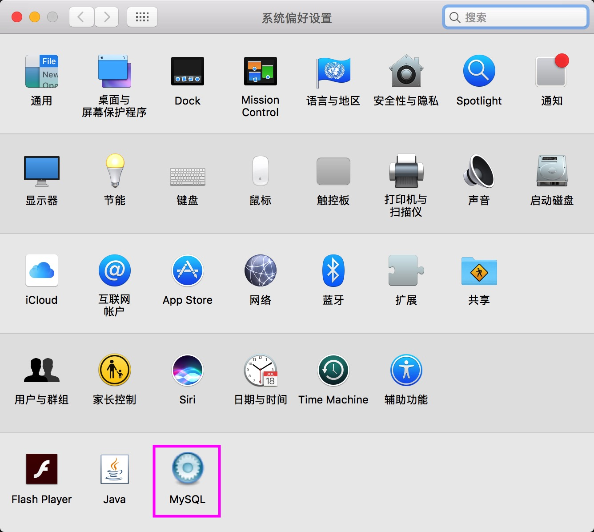
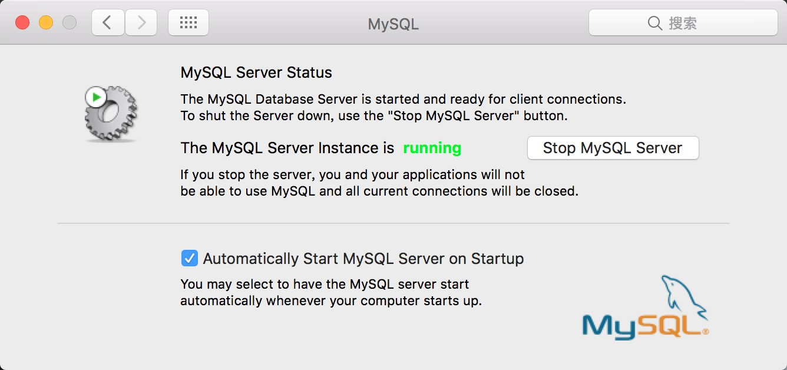

# 在 macOS 下安装和运行 MySQL

## 安装
### 使用 DMG 安装包进行安装
进入 [下载][1]  下载社区版, 双击安装, 选择"自定"可按需选择要安装的功能.  


勾选 `Preference Pane` 会将 MySQL 集成到系统偏好设置中, 如下图所示:


此后就可以在这里控制 MySQL 的运行状态, 或配置为随系统启动.

可以看到, 安装完成后, MySQL 服务器已经启动.

[Installing MySQL on OS X Using Native Packages][2]

## 连接 MySQL
macOS 下GUI 客户端有: MySQL Workbench;  

命令行下可以使用 `mysql` 命令连接, 但是默认并没有将 MySQL 添加到 shell 中.  
在命令行中执行以下命令:
```shell
echo 'export PATH=/usr/local/mysql/bin:$PATH' >> ~/.bash_profile
```
然后执行以下命令重载 bash_profile:
```shell
. ~/.bash_profile
```
现在就可以在命令行中使用`mysql` 命令连接 MySQL 服务器了.
```
mysql -h xxx.xxx.xxx.xxx -u username -p
```

## 卸载
要卸载 MySQL, 删除以下文件即可:
```
sudo rm /usr/local/mysql
sudo rm -rf /usr/local/mysql*
sudo rm -rf /Library/StartupItems/MySQLCOM
sudo rm -rf /Library/PreferencePanes/MySQL*
rm -rf ~/Library/PreferencePanes/MySQL*
sudo rm -rf /Library/Receipts/mysql*
sudo rm -rf /Library/Receipts/MySQL*
sudo rm -rf /var/db/receipts/com.mysql.*
```

## 参考


[1]:https://dev.mysql.com/downloads/mysql/
[2]:https://dev.mysql.com/doc/refman/5.7/en/osx-installation-pkg.html